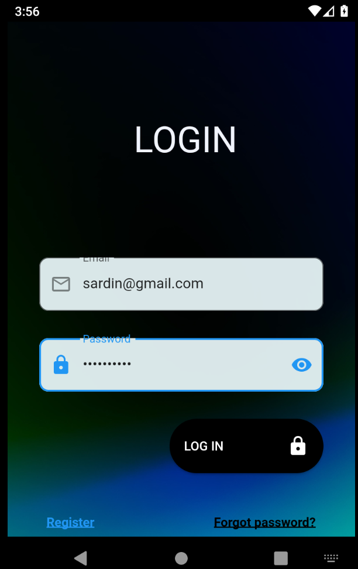
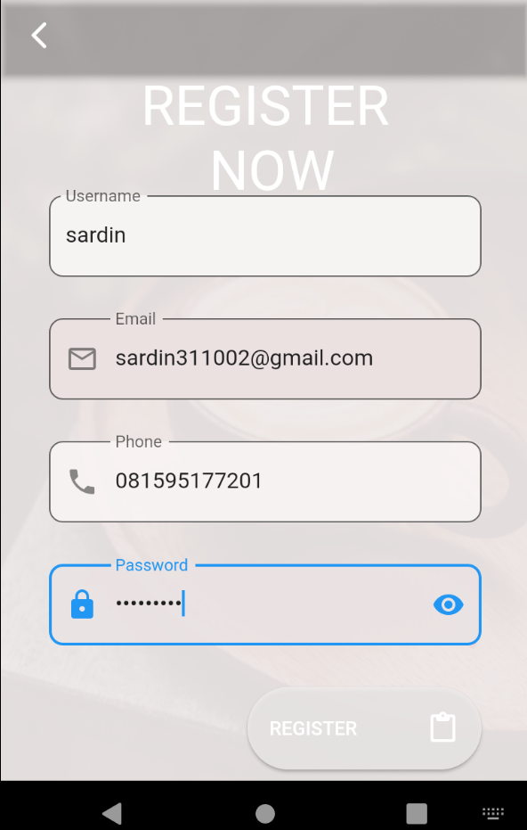
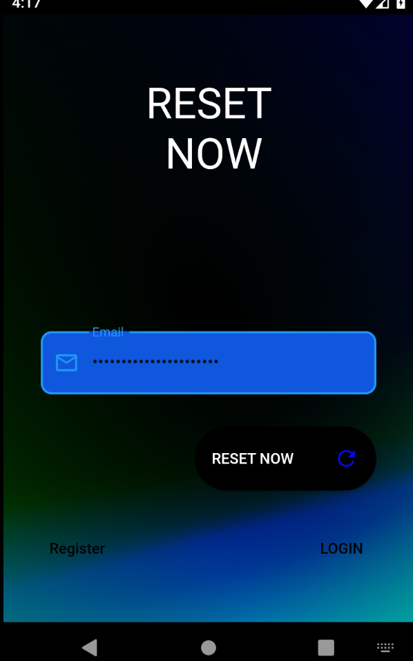

# Ulangan Tengah Semester (UTS)

<hr>
Nama    : Sardin <br>

NIM : 312010135 <br>

Kelas : TI.20. A.1 <br>

<hr>

# LOGIN FORM BY FLUTTER

This project focuses on UI Mobile Design. I am using Visual Studio Code and utilizing the devices plugin.

Once you have prepared the necessary tools and prerequisites for the UI mobile design project, you can proceed with the following steps:

- Open Visual Studio Code (VSCode) and make sure you have installed the required extensions: Dart, Flutter, and Flutter Widget.

- Connect your mobile device to your computer using a USB cable. It is important to ensure that you have downloaded and installed the appropriate ADB (Android Debug Bridge) driver for your specific device. This step may vary depending on the device you are using. You can search for the specific instructions for your device online.

- Put your mobile device in Debug Mode. The method to enable Debug Mode may vary depending on the device and the Android version you are using. Typically, you can enable it by going to the "Developer options" in the device settings. If you don't see the "Developer options" menu, you may need to enable it first. Again, you can find device-specific instructions online.

- Once your device is connected and in Debug Mode, you can clone the repository for the UI mobile design project to your local machine. You can use Git or simply download the project as a zip file and extract it to a desired location on your computer.

- After cloning the repository, open the project folder in Visual Studio Code. You can do this by selecting "File" > "Open Folder" and navigating to the location where you cloned the repository.

Now you are ready to start working on the UI mobile design project using Visual Studio Code. You can utilize the Flutter and Dart extensions to write code, and the Flutter Widget extension can assist you in creating and managing the UI components for your mobile app.

# Configuration for Development

Duplicate the repository and execute the subsequent commands:

```
flutter pub get
flutter run
```

# Output

## Tampilan Welcome



## Tampilan Login



## Tampilan sign up


